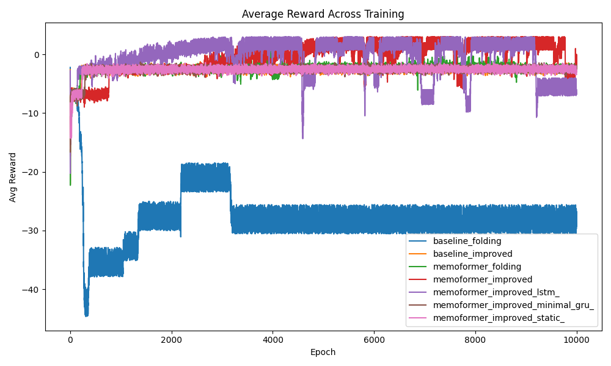
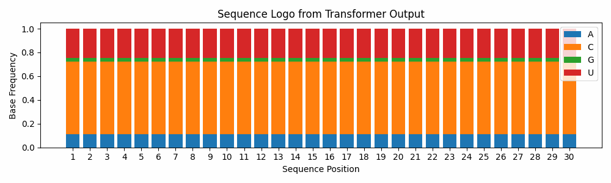

#  Never Forget to Attend

**What if transformers could learn to fold RNA?**  
We built a system that learns to generate biologically structured RNA sequences using a memory-augmented transformer trained with reinforcement learning.

This repository explores:
-  Transformer-based sequence generation
-  Structure-aware reward functions
-  Differentiable surrogate folding models
-  Memory tokens vs. GRU vs. LSTM-style memory variants

---

##  How it works

We train a causal transformer to sample nucleotide sequences that:
- Match GC content targets
- Hit motif placement objectives
- Avoid repetition
- Optimize folding energy (via a learned surrogate)

A differentiable reward pipeline makes it end-to-end trainable.

---

##  Early Results

### Reward progression across models:



---

### Sequence evolution during training:



---

## 🚀 Try it

To start training:

```bash
python train_.py
